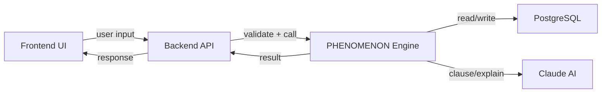
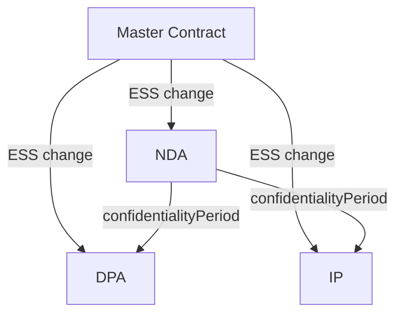
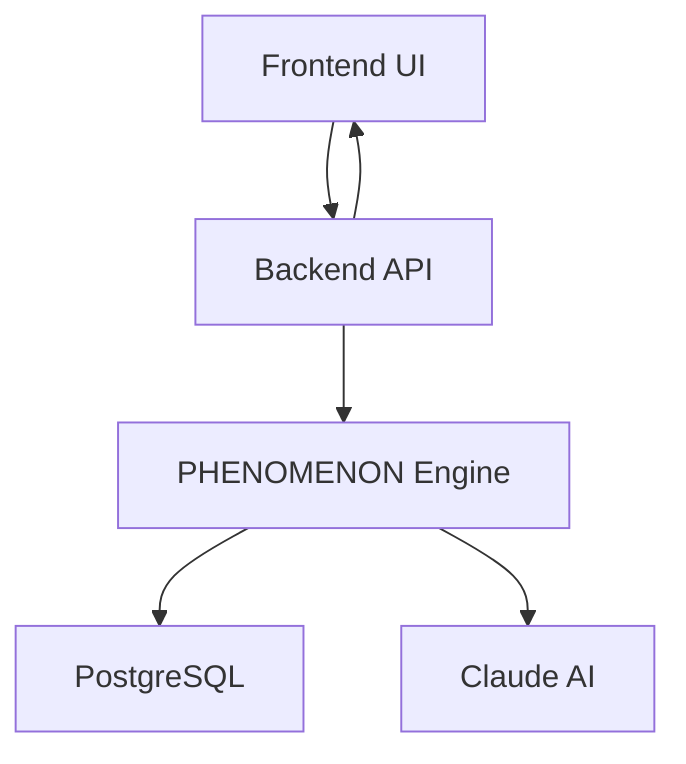
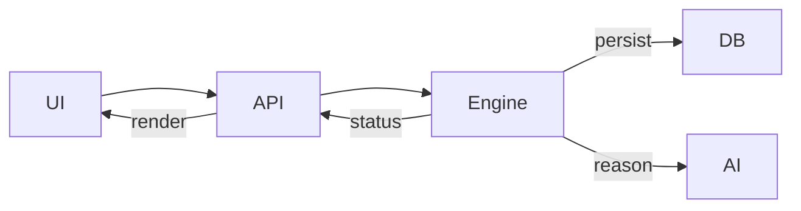
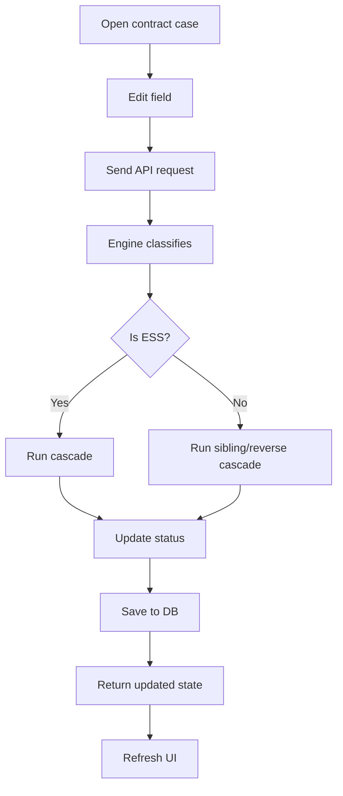

# PHENOMENON Engine Overview

## Executive Summary
PHENOMENON is a contract intelligence system built around a central engine that models legal contracts as **phenomena**. The engine is the center of the application, interpreting contract structure and relationships, judging legal logic, and propagating changes across related agreements.

The system distinguishes between:
- **ESS** — the contract's stable identity
- **AG** — the contract's operative content
- **IA operators** — vectorial interactions
- **IF connections** — relationships between contracts
- **Opus / homologation** — contract validation state

This document explains how the engine works, why it is the centerpoint, and how the application uses it to solve real contract cases.

---

## 1. System architecture

### 1.1 Main components

| Component | Role |
|---|---|
| Frontend | React UI for contract editing, graph visualization, and status feedback |
| Backend | FastAPI API that validates requests and orchestrates engine calls |
| Engine | PHENOMENON ontology, cascade logic, and contract judgment |
| Database | PostgreSQL persistence for phenomena and JSON contract data |
| Claude AI | Natural-language clause generation and explanation layer |

### 1.2 Why the engine is central

The engine is the central hub because it provides the contract semantics and the reasoning rules used by the entire application:
- It decides whether a field is ESS or AG.
- It determines contract equivalence and identity.
- It applies cascade propagation rules between contracts.
- It computes review status changes like `NEEDS_REVIEW`.
- It evaluates contract homologation.

No other component has this full contract-level logic.

### 1.3 Core file mapping

- `phenomenon/packages/engine/phenomenon_engine/models.py`
- `phenomenon/packages/engine/phenomenon_engine/bloque_i.py`
- `phenomenon/packages/engine/phenomenon_engine/cascade_engine.py`
- `phenomenon/apps/contracts/backend/app/main.py`
- `phenomenon/apps/contracts/frontend/src/hooks/usePhenomenon.js`
- `phenomenon/apps/contracts/frontend/src/constants.js`

---

## 2. Core engine concepts

### 2.1 Phenomenon structure

A contract is modeled as a `PhenomenonRecord` with these main components:
- `id` — unique identifier
- `type` — contract category, e.g. `MASTER`, `NDA`, `SLA`, `PAYMENT`, `DPA`, `IP`, `FINANCIACION`
- `name` — human-readable contract title
- `status` — lifecycle status such as `ACTIVE`, `MODIFIED`, `NEEDS_REVIEW`
- `ess` — `EssFields` stable identity data
- `ag` — free-form operative terms and clauses
- `ia_instances` — list of IA operator labels
- `vectors` — list of `Vector` objects describing vectorial contract force
- `opus` — validation/homologation state
- `parentId` — master contract link
- `children` — child contract IDs

### 2.2 ESS vs AG

The engine uses the PHENOMENON duality from `bloque_i.py`:
- `ESS` = the contract's being, its fixed identity
- `AG` = the contract's doing, its operative behavior

#### ESS fields
Defined in `EssFields`:
- `partyA`
- `partyB`
- `jurisdiction`
- `effectiveDate`
- `expiryDate`

These fields form the contract's geometric center. Changing them changes the phenomenon's identity.

#### AG content
Stored in `ag` as a flexible JSON dictionary.
It includes clauses, terms, numeric values, and domain-specific fields.
AG is dynamic: it represents what the contract does, not what it is.

### 2.3 IA operators

The engine represents contract interactions with IA operators. These are not simple labels; they express legal vector behavior.
- `ad-actio` — active projection, obligation in motion
- `de-actio` — separation, retroactive break
- `ob-actio` — operative obligation layer
- `co-implication` — coexistence of multiple vectors
- `non` — exclusion or blocking
- `IF` — inter-phenomenic transition between contracts
- `stabilization` — persistence and ongoing stability

IA operators are used by the engine to interpret contract semantics and decide how changes move through the ecosystem.

### 2.4 Vectors

A `Vector` object captures the force of a contract relation:
- `lation`
- `sense`
- `direction`
- `position`
- `plication`

Vectors represent legal directionality and strength. They are the engine's internal geometric model for how an agreement exerts influence.

### 2.5 Opus and homologation

`OpusState` tracks contract validation:
- `status` — state like `ACTIVE`, `MODIFIED`, `NEEDS_REVIEW`, `TERMINATED`
- `homologation` — validation status like `PENDING`, `VALID`, `INVALID`

Homologation is how the engine stabilizes a contract and judges whether it is valid in its current form.

---

## 3. Movement process and interaction flow

### 3.1 High-level flow

### 3.2 How the application uses the engine

1. User edits a contract in the frontend.
2. Frontend sends the change to the backend API.
3. The backend loads the contract phenomenon and forwards it to the engine.
4. The engine classifies the changed field as ESS or AG.
5. If ESS changed, the engine runs cascade propagation.
6. If AG changed, the engine may run sibling or reverse cascade rules.
7. The engine updates contract statuses and saves changes.
8. The backend returns the updated contract state.
9. The frontend refreshes the UI and graph.

### 3.3 Engine as judge

The engine judges contracts by checking:
- `ESS completeness` — if essential identity fields are present
- `Opus homologation` — if validation criteria are met
- `IF consistency` — if related contracts remain aligned

If any check fails, the engine flags the contract as `NEEDS_REVIEW`.

---

## 4. Cascade and contract propagation

### 4.1 Cascade maps

The cascade engine uses three rule maps:
- `CASCADE_MAP` — master ESS changes affecting child contracts
- `SUB_CASCADE_MAP` — sibling contract changes affecting related siblings
- `REVERSE_CASCADE_MAP` — sub-contract changes requiring master review

These maps are defined in `cascade_engine.py`.

### 4.2 Master-to-sub cascade

When a master's ESS field changes, the engine:
- updates the master's ESS value
- marks the master `MODIFIED`
- finds child contracts linked by `parentId`
- updates matching ESS fields on affected children
- marks those children `NEEDS_REVIEW`
- resets their homologation to `PENDING`

This ensures the contract ecosystem stays coherent when identity changes occur.

### 4.3 Sibling and reverse cascade

The engine also models contract ecosystems with sibling and reverse relationships.
For example:
- `NDA.confidentialityPeriod` changes can affect `DPA` and `IP`
- `SLA.penaltyPct` changes can affect `PAYMENT`
- `COBERTURA_VIDA` changes can trigger review of the master policy

This is how the engine judges not only the edited contract, but the contract network.

### 4.4 Example cascade flow

If `Master.jurisdiction` changes, the engine updates `Sub1`, `Sub2`, and `Sub3` and marks them for review.

---

## 5. Case-solving potential

### 5.1 Insurance case (Seguros)

The engine models insurance as a contract ecosystem with coverage and exclusion phenomena:
- `COBERTURA_VIDA`
- `EXCLUSIONES_VIDA`
- `PRIMA_VIDA`
- `VALIDACION_FINANCIERA`
- `COBERTURA_CREDITO`
- `PERITACION`
- `COBERTURA_DANOS`

It can represent `IF_non` exclusion logic: active exclusions block coverage and trigger review.
This turns insurance complexity into a structured decision network.

### 5.2 Corporate case (KPMG)

The engine supports corporate finance and governance flows:
- `FINANCIACION`
- `HIPOTECA_GARANTIA`
- `CESION_CREDITO`
- `COMPLIANCE_CHECK`
- `AUDIT_REPORT`
- `REGULATORY_APPROVAL`
- `BOARD_RESOLUTION`

It can capture approval gates and regulatory blocking conditions, making the ecosystem coherent across finance and governance.

### 5.3 General potential

The engine's value is its ability to:
- reuse the same contract model across domains
- detect cross-document inconsistencies
- surface review requirements clearly
- support contract simulation and structural validation

---

## 6. Diagrams and flowcharts

### 6.1 Component diagram

### 6.2 Engine centrality

### 6.3 Contract workflow

---

## 7. Practical guidance

### 7.1 How to use this document
- Use this overview when modifying engine behavior.
- Use it when adding new contract domains.
- Use it when debugging cascade or homologation issues.

### 7.2 What the engine is not
- It is not a natural language legal advisor.
- It is not a formal legal certification engine.
- It is a structural contract intelligence engine for internal coherence and review.

### 7.3 Best next steps for the engine
- add more domain-specific IF cascade rules
- add richer homologation checks for AG logic
- build a legal translation layer for user-facing terminology
- add ecosystem-level consistency evaluation

### 7.4 Slide-ready summary
Use this structure when presenting the PHENOMENON engine to stakeholders:

- **Slide 1: What PHENOMENON is**
  - A contract intelligence system with a central reasoning engine.
  - It treats contracts as related phenomena, not isolated forms.

- **Slide 2: Why the engine is the centerpoint**
  - It decides ESS vs AG.
  - It preserves contract identity.
  - It propagates changes through IF links.

- **Slide 3: Core concepts**
  - ESS = contract identity
  - AG = operative clauses and terms
  - IA = interaction operators
  - IF = contract dependencies
  - Opus = validation and enforceability state

- **Slide 4: System flow**
  - Frontend collects edits → backend validates → engine applies logic → DB persists → frontend renders status.

- **Slide 5: Case examples**
  - Seguros: coverage, exclusions, financial validation.
  - KPMG corporate: financing, guarantees, governance approvals.
  - General: ecosystem consistency, contract review, structural validation.

- **Slide 6: What the engine judges**
  - ESS completeness
  - homologation validity
  - IF consistency across related contracts

- **Slide 7: What the engine does not do**
  - It does not replace a lawyer.
  - It does not certify legal compliance on its own.
  - It is a structural quality gate.

### 7.5 Legal translation companion
For lawyer-facing presentation, replace engine terminology with standard legal language:

- `ESS` → Contract identity and essential terms
- `AG` → Contract obligations, clauses, and business terms
- `IF` → Inter-contract dependencies and conditions
- `Opus` → Contract validation state / enforceability level
- `IA operators` → Legal behavior operators (active obligation, exclusion, continuity)

Present the engine as a tool that:
- validates structural consistency across related documents
- flags the exact contracts that need review
- tracks whether each agreement remains coherent after changes

Suggested wording for legal audiences:

> "The engine validates the structure of the legal ecosystem and identifies the agreements that need review. It is a quality gate, not legal advice."

> "We map contract identity, obligations, dependencies, and enforceability state. The system is built to detect when a change in one document should trigger review in the others."

---

## 8. References
- `phenomenon/packages/engine/phenomenon_engine/models.py`
- `phenomenon/packages/engine/phenomenon_engine/bloque_i.py`
- `phenomenon/packages/engine/phenomenon_engine/cascade_engine.py`
- `phenomenon/apps/contracts/backend/app/main.py`
- `phenomenon/apps/contracts/frontend/src/hooks/usePhenomenon.js`
- `phenomenon/apps/contracts/frontend/src/constants.js`
